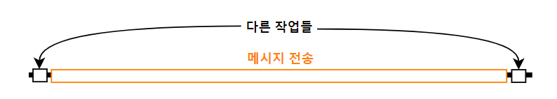

# reinforce
&nbsp;카톡봇의 일부 기능을 대체하여 성능을 향상시켜주는 패키지.

&nbsp;***inspire - util.ThreadManager*** 패키지를 필요로 합니다.

- [send](#send)
- [event_loop](#event_loop)


&nbsp;

&nbsp;

------------------------------
## send
&nbsp;메시지 전송을 비동기로 빼버린다.

&nbsp;

### intro_

&nbsp;카톡봇에서 메시지 전송은 타 연산에 비해 매우 많은 시간을 잡아먹습니다. 구체적으로는, 나노초(10⁻⁶s)에서 마이크로초(10⁻⁹s) 단위의 연산에 비해 **평균적으로 10ms~30ms(ms=10⁻³s), 약 10³~10⁷배를 소요**합니다.



&nbsp;그런 연산이 위 그림처럼 다른 것들 중간에 껴 있으니 필요 연산이 많아질수록 원활한 처리가 요원해질 수밖에 없습니다. 그런데도 그 결과가 굳이 필요하진 않으니, 따라서 이를 아래와 같이 분리시켰습니다.


&nbsp;실제 전송 속도가 빨라지지는 않습니다. 하지만 ***전송을 시작하는 코드***가 더 빨리 처리되고, 다른 중요한 연산을 막힘없이 진행할 수 있으니 전반적인 성능 향상을 기대해볼 수 있습니다.

&nbsp;

### changes
&nbsp;환경에 따라 다른 게 바뀝니다. 사용법은 완전히 동일하니 기존에 작성한 코드를 변경할 일은 없습니다.

##### 레거시
```javascript
Api.replyRoom(방, 전송할 메시지)
```

##### API2
```javascript
const bot = BotManager.getCurrentBot()
bot.send(방, 전송할 메시지) // 이거
```

&nbsp;ThreadManager를 통해 사용하는 **스레드의 이름**은 모듈의 ***SEND_THREAD*** 속성으로 확인할 수 있습니다.

&nbsp;

### Tip
&nbsp;메시지 이벤트에 반응하는 함수의 인자로 들어오는 reply() 에는 적용되지 않으므로, 아래와 같이 대체시켜줄 수 있습니다.

##### 레거시
```javascript
inspire('reinforce.send')

function response(room, ... , replier, ...){
    replier.reply = m => Api.replyRoom(room, m)
}
```

##### API2
```javascript
const bot = BotManager.getCurrentBot()

function onMessage(msg){
    msg.reply = m => bot.send(msg.room, m)
}

bot.addListener(Event.MESSAGE, onMessage)
```

&nbsp;

&nbsp;

&nbsp;

----------------------------
## event_loop
&nbsp;**바닐라 JS의 브라우저 상 이벤트 루프**를 문법적인 지원이 필요한 async를 제외하고 구현한 모듈입니다.

[이벤트 루프에 대한 설명](https://youtu.be/v67LloZ1ieI)

&nbsp;

### Intro_
&nbsp;현 카톡봇이 구동되는 **RhinoJS** 엔진은 기존 JS의 비동기 작업을 수행할 때 이벤트 루프 구조를 따르는 대신 **매번 새로운 스레드를 생성하여 작업**합니다. 이는 프로그램에도 부담(속도 저하 등)이 될 뿐만 아니라, 브라우저에서는 발생하지 않던 여러 [***멀티스레딩의 단점***](https://velog.io/@hkh1213/%EB%A9%80%ED%8B%B0%EC%8A%A4%EB%A0%88%EB%94%A9%EC%9D%98-%EC%9E%A5%EC%A0%90-%EB%8B%A8%EC%A0%90)을 가져옵니다.

&nbsp;카톡봇은 같이 메시지가 올 시 새로운 스레드를 생성하여 응답을 처리합니다. 일종의 서버와 같기 때문에 필요한 부분이지만, 과도한 멀티스레딩에 대한 대책은 필요했습니다.

&nbsp;

### changes
&nbsp;거창하게 설명했지만, 많은 게 변하진 않습니다. 아래 네 함수가 대체됩니다. 인터페이스는 그대로입니다.

- setTimeout()
- clearTimeout()
- setInterval()
- clearInterval()

&nbsp;event_loop에서 ThreadManager를 통해 사용하는 스레드의 이름은 모듈의 ***MAIN_THREAD*** 속성으로 확인할 수 있습니다.

&nbsp;***util.Promise*** 모듈은 위 네 함수에 의존하기 때문에 해당 모듈 적용에 간접적으로 영향을 받습니다.

&nbsp;

### Tip_
&nbsp;***ThreadManager.sync()*** 를 응용하면 응답도 이벤트 루프에 포함시킬 수 있습니다. 굳이 필요할진 모르겠지만, 스레드를 다루는 데 자신이 있으시다면 의외의 효율성을 얻을 수도?

##### 레거시
```javascript
// util.ThreadManager도 자동으로 inspire
const event_loop = inspire('reinforce.event_loop')

const response = ThreadManager.sync(
    event_loop.MAIN_THREAD,
    function response(...){
        ...
    }
)

function onStartCompile(){
    ThreadManager.stopAll()
}
```

##### API2
```javascript
// util.ThreadManager도 자동으로 inspire
const event_loop = inspire('reinforce.event_loop')

const onMessage = ThreadManager.sync(
    event_loop.MAIN_THREAD,
    function (msg){
        ...
    }
)

// 대충 MESSAGE랑 START_COMPILE 리스너 추가 코드
```